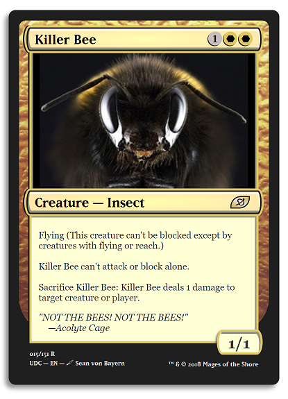

# Animal Trading Card

This was my submission for an HTML/CSS design project that was part of Udacity's Introduction to Programming Nanodegree – it was a fun opportunity to recreate a design prototype with few restrictions!
  
Here's the result:

  

